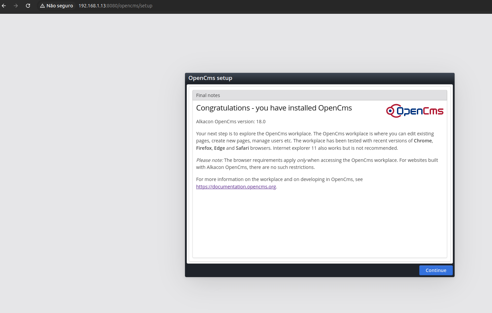
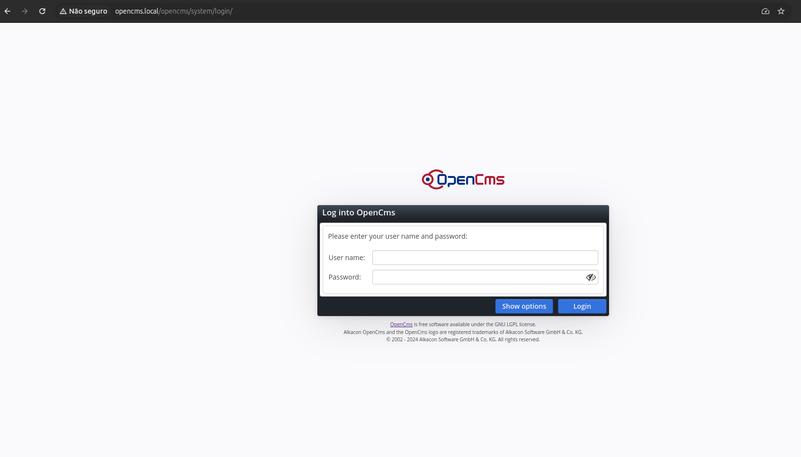

Optei por subir uma máquina virtual com o Vagrant junto com o Virtualbox

```
vagrant init adavilag/ubuntu-server-22.04.1
```
```
root@victor-ubuntu:/home/victor/ubuntu-server-opencms# ls -lha
total 16K
drwxr-xr-x  3 root   root   4,0K out 19 11:49 .
drwxr-x--- 22 victor victor 4,0K out 19 11:47 ..
drwxr-xr-x  4 root   root   4,0K out 19 11:50 .vagrant
-rw-r--r--  1 root   root   3,4K out 19 11:49 Vagrantfile
```
Após a conclusão do processo, descomentei a seguinte linha para deixar a rede como bridged
```
  # Create a public network, which generally matched to bridged network.
  # Bridged networks make the machine appear as another physical device on
  # your network.
  config.vm.network "public_network"
```
Após, executado o comando ```vagrant up``` no mesmo diretório  

:warning: Dependências do OpenCms

:arrow_right: OpenCms supports Java 8 and Java 11 LTS.

:arrow_right: OpenCms supports Tomcat 9.x and 8.x.

Instalado versão 11 do OpenJDK
```
sudo apt install openjdk-11-jdk
```
```
root@vagrant:/opt/tomcat/logs# java --version
openjdk 11.0.24 2024-07-16
OpenJDK Runtime Environment (build 11.0.24+8-post-Ubuntu-1ubuntu320.04)
OpenJDK 64-Bit Server VM (build 11.0.24+8-post-Ubuntu-1ubuntu320.04, mixed mode, sharing)
```
Criado um usuário para o Tomcat
```
sudo useradd -m -d /opt/tomcat -U -s /bin/false tomcat
```
No diretório /tmp, efetuado download do Tomcat
```
wget https://dlcdn.apache.org/tomcat/tomcat-9/v9.0.96/bin/apache-tomcat-9.0.96.tar.gz
```
```
root@vagrant:/tmp# ls -lha
total 13M
drwxrwxrwt 11 root root 4.0K Oct 19 14:57 .
drwxr-xr-x 19 root root 4.0K Oct 19 14:53 ..
-rw-r--r--  1 root root  13M Oct  3 20:27 apache-tomcat-9.0.96.tar.gz
drwxrwxrwt  2 root root 4.0K Oct 19 14:54 .font-unix
drwxr-xr-x  2 root root 4.0K Oct 19 14:56 hsperfdata_root
drwxrwxrwt  2 root root 4.0K Oct 19 14:54 .ICE-unix
drwx------  2 root root 4.0K Oct 19 14:54 netplan_eep5ooly
drwx------  3 root root 4.0K Oct 19 14:54 systemd-private-c0dd8f4b968a4b80b9f00ba531ea66c4-systemd-logind.service-9twWhf
drwx------  3 root root 4.0K Oct 19 14:54 systemd-private-c0dd8f4b968a4b80b9f00ba531ea66c4-systemd-resolved.service-1YcmBf
drwxrwxrwt  2 root root 4.0K Oct 19 14:54 .Test-unix
drwxrwxrwt  2 root root 4.0K Oct 19 14:54 .X11-unix
drwxrwxrwt  2 root root 4.0K Oct 19 14:54 .XIM-unix
```
Descompactado no diretório /opt/tomcat
```
sudo tar xzvf apache-tomcat-9*tar.gz -C /opt/tomcat --strip-components=1
```

Alterado o owner e o group do diretório
```
sudo chown -R tomcat:tomcat /opt/tomcat/
```

Liberado permissão de execução para o usuário Tomcat
```
sudo chmod -R u+x /opt/tomcat/bin no diretório /bin
```

Criado um serviço do Tomcat
```
sudo nano /etc/systemd/system/tomcat.service
```
```
[Unit]
Description=Tomcat
After=network.target

[Service]
Type=forking

User=tomcat
Group=tomcat

Environment="JAVA_HOME=/usr/lib/jvm/java-1.11.0-openjdk-amd64"
Environment="JAVA_OPTS=-Djava.security.egd=file:///dev/urandom"
Environment="CATALINA_BASE=/opt/tomcat"
Environment="CATALINA_HOME=/opt/tomcat"
Environment="CATALINA_PID=/opt/tomcat/temp/tomcat.pid"


ExecStart=/opt/tomcat/bin/startup.sh
ExecStop=/opt/tomcat/bin/shutdown.sh

RestartSec=10
Restart=always

[Install]
WantedBy=multi-user.target
```
Reiniciado o daemon, iniciado o Tomcat e habilitado na inicialização do sistemas
```
systemctl daemon-reload
 sudo systemctl start tomcat
ystemctl status tomcat
● tomcat.service - Tomcat
     Loaded: loaded (/etc/systemd/system/tomcat.service; enabled; vendor preset: enabled)
     Active: active (running) since Sat 2024-10-19 14:59:10 UTC; 14s ago
   Main PID: 3564 (java)
      Tasks: 28 (limit: 9515)
     Memory: 95.6M
     CGroup: /system.slice/tomcat.service
             └─3564 /usr/lib/jvm/java-1.11.0-openjdk-amd64/bin/java -Djava.util.logging.config.file=/opt/tomcat/conf/logging.properties -Djava.util.logging.manager=org.apache.juli.ClassLoad>

Oct 19 14:59:10 vagrant systemd[1]: Starting Tomcat...
Oct 19 14:59:10 vagrant startup.sh[3542]: Tomcat started.
Oct 19 14:59:10 vagrant systemd[1]: Started Tomcat.
```
Instalado o postgresql
```
sudo apt install postgresql
```
```
systemctl status postgresql
● postgresql.service - PostgreSQL RDBMS
     Loaded: loaded (/lib/systemd/system/postgresql.service; enabled; vendor preset: enabled)
     Active: active (exited) since Sat 2024-10-19 12:01:02 -03; 17s ago
   Main PID: 4693 (code=exited, status=0/SUCCESS)
      Tasks: 0 (limit: 9515)
     Memory: 0B
     CGroup: /system.slice/postgresql.service

Oct 19 12:01:02 vagrant systemd[1]: Starting PostgreSQL RDBMS...
Oct 19 12:01:02 vagrant systemd[1]: Finished PostgreSQL RDBMS.
root@vagrant:/tmp# 
```
Verificado a versão do postgresql
```
psql --version

psql (PostgreSQL) 12.20 (Ubuntu 12.20-0ubuntu0.20.04.1)
```
No diretório /opt efetuado o download o opencms
```
wget http://www.opencms.org/downloads/opencms/opencms-18.0.zip
```
Extraido o opencms 
```
unzip opencms-18.0.zip
```

Movido para o diretório dos apps do tomcat
```
mv opencms tomcat/webapps/
```
Reiniciado o tomcat
```
systemctl restart tomcat
```
Ajustado permissão no diretório do opencms do Tomcat
```
chown -R tomcat:tomcat /opt/tomcat/webapps/opencms
sudo chmod -R 755 /opt/tomcat/webapps/opencms
```
Opencms iniciado

```
19-Oct-2024 01:11:15.979 INFO [main] org.apache.catalina.startup.VersionLoggerListener.log Server version name:   Apache Tomcat/9.0.96
19-Oct-2024 01:11:15.989 INFO [main] org.apache.catalina.startup.VersionLoggerListener.log Server built:          Oct 3 2024 19:44:30 UTC
19-Oct-2024 01:11:15.989 INFO [main] org.apache.catalina.startup.VersionLoggerListener.log Server version number: 9.0.96.0
19-Oct-2024 01:11:15.989 INFO [main] org.apache.catalina.startup.VersionLoggerListener.log OS Name:               Linux
19-Oct-2024 01:11:15.989 INFO [main] org.apache.catalina.startup.VersionLoggerListener.log OS Version:            5.4.0-99-generic
19-Oct-2024 01:11:15.992 INFO [main] org.apache.catalina.startup.VersionLoggerListener.log Architecture:          amd64
19-Oct-2024 01:11:15.992 INFO [main] org.apache.catalina.startup.VersionLoggerListener.log Java Home:             /usr/lib/jvm/java-11-openjdk-amd64
19-Oct-2024 01:11:15.992 INFO [main] org.apache.catalina.startup.VersionLoggerListener.log JVM Version:           11.0.24+8-post-Ubuntu-1ubuntu320.04
19-Oct-2024 01:11:15.992 INFO [main] org.apache.catalina.startup.VersionLoggerListener.log JVM Vendor:            Ubuntu
19-Oct-2024 01:11:15.992 INFO [main] org.apache.catalina.startup.VersionLoggerListener.log CATALINA_BASE:         /opt/tomcat
19-Oct-2024 01:11:15.992 INFO [main] org.apache.catalina.startup.VersionLoggerListener.log CATALINA_HOME:         /opt/tomcat
19-Oct-2024 01:11:16.030 INFO [main] org.apache.catalina.startup.VersionLoggerListener.log Command line argument: --add-opens=java.base/java.lang=ALL-UNNAMED
19-Oct-2024 01:11:16.030 INFO [main] org.apache.catalina.startup.VersionLoggerListener.log Command line argument: --add-opens=java.base/java.io=ALL-UNNAMED
19-Oct-2024 01:11:16.030 INFO [main] org.apache.catalina.startup.VersionLoggerListener.log Command line argument: --add-opens=java.base/java.util=ALL-UNNAMED
19-Oct-2024 01:11:16.030 INFO [main] org.apache.catalina.startup.VersionLoggerListener.log Command line argument: --add-opens=java.base/java.util.concurrent=ALL-UNNAMED
19-Oct-2024 01:11:16.034 INFO [main] org.apache.catalina.startup.VersionLoggerListener.log Command line argument: --add-opens=java.rmi/sun.rmi.transport=ALL-UNNAMED
19-Oct-2024 01:11:16.034 INFO [main] org.apache.catalina.startup.VersionLoggerListener.log Command line argument: -Djava.util.logging.config.file=/opt/tomcat/conf/logging.properties
19-Oct-2024 01:11:16.034 INFO [main] org.apache.catalina.startup.VersionLoggerListener.log Command line argument: -Djava.util.logging.manager=org.apache.juli.ClassLoaderLogManager
19-Oct-2024 01:11:16.034 INFO [main] org.apache.catalina.startup.VersionLoggerListener.log Command line argument: -Djava.security.egd=file:///dev/urandom
19-Oct-2024 01:11:16.034 INFO [main] org.apache.catalina.startup.VersionLoggerListener.log Command line argument: -Djdk.tls.ephemeralDHKeySize=2048
19-Oct-2024 01:11:16.034 INFO [main] org.apache.catalina.startup.VersionLoggerListener.log Command line argument: -Djava.protocol.handler.pkgs=org.apache.catalina.webresources
19-Oct-2024 01:11:16.035 INFO [main] org.apache.catalina.startup.VersionLoggerListener.log Command line argument: -Dorg.apache.catalina.security.SecurityListener.UMASK=0027
19-Oct-2024 01:11:16.035 INFO [main] org.apache.catalina.startup.VersionLoggerListener.log Command line argument: -Xms512M
19-Oct-2024 01:11:16.035 INFO [main] org.apache.catalina.startup.VersionLoggerListener.log Command line argument: -Xmx1024M
19-Oct-2024 01:11:16.035 INFO [main] org.apache.catalina.startup.VersionLoggerListener.log Command line argument: -XX:+UseParallelGC
19-Oct-2024 01:11:16.035 INFO [main] org.apache.catalina.startup.VersionLoggerListener.log Command line argument: -Dignore.endorsed.dirs=
19-Oct-2024 01:11:16.035 INFO [main] org.apache.catalina.startup.VersionLoggerListener.log Command line argument: -Dcatalina.base=/opt/tomcat
19-Oct-2024 01:11:16.035 INFO [main] org.apache.catalina.startup.VersionLoggerListener.log Command line argument: -Dcatalina.home=/opt/tomcat
19-Oct-2024 01:11:16.035 INFO [main] org.apache.catalina.startup.VersionLoggerListener.log Command line argument: -Djava.io.tmpdir=/opt/tomcat/temp
19-Oct-2024 01:11:16.042 INFO [main] org.apache.catalina.core.AprLifecycleListener.lifecycleEvent The Apache Tomcat Native library which allows using OpenSSL was not found on the java.library.path: [/usr/java/packages/lib:/usr/lib/x86_64-linux-gnu/jni:/lib/x86_64-linux-gnu:/usr/lib/x86_64-linux-gnu:/usr/lib/jni:/lib:/usr/lib]
19-Oct-2024 01:11:16.905 INFO [main] org.apache.coyote.AbstractProtocol.init Initializing ProtocolHandler ["http-nio-8080"]
19-Oct-2024 01:11:16.982 INFO [main] org.apache.catalina.startup.Catalina.load Server initialization in [1566] milliseconds
19-Oct-2024 01:11:17.137 INFO [main] org.apache.catalina.core.StandardService.startInternal Starting service [Catalina]
19-Oct-2024 01:11:17.138 INFO [main] org.apache.catalina.core.StandardEngine.startInternal Starting Servlet engine: [Apache Tomcat/9.0.96]
19-Oct-2024 01:11:17.172 INFO [main] org.apache.catalina.startup.HostConfig.deployWAR Deploying web application archive [/opt/tomcat/webapps/opencms.war]
NOTE: Picked up JDK_JAVA_OPTIONS:  --add-opens=java.base/java.lang=ALL-UNNAMED --add-opens=java.base/java.io=ALL-UNNAMED --add-opens=java.base/java.util=ALL-UNNAMED --add-opens=java.base/java.util.concurrent=ALL-UNNAMED --add-opens=java.rmi/sun.rmi.transport=ALL-UNNAMED
19-Oct-2024 01:11:42.331 INFO [main] org.apache.catalina.startup.VersionLoggerListener.log Server version name:   Apache Tomcat/9.0.96
19-Oct-2024 01:11:42.340 INFO [main] org.apache.catalina.startup.VersionLoggerListener.log Server built:          Oct 3 2024 19:44:30 UTC
19-Oct-2024 01:11:42.341 INFO [main] org.apache.catalina.startup.VersionLoggerListener.log Server version number: 9.0.96.0
19-Oct-2024 01:11:42.341 INFO [main] org.apache.catalina.startup.VersionLoggerListener.log OS Name:               Linux
19-Oct-2024 01:11:42.341 INFO [main] org.apache.catalina.startup.VersionLoggerListener.log OS Version:            5.4.0-99-generic
19-Oct-2024 01:11:42.341 INFO [main] org.apache.catalina.startup.VersionLoggerListener.log Architecture:          amd64
19-Oct-2024 01:11:42.341 INFO [main] org.apache.catalina.startup.VersionLoggerListener.log Java Home:             /usr/lib/jvm/java-11-openjdk-amd64
19-Oct-2024 01:11:42.346 INFO [main] org.apache.catalina.startup.VersionLoggerListener.log JVM Version:           11.0.24+8-post-Ubuntu-1ubuntu320.04
19-Oct-2024 01:11:42.346 INFO [main] org.apache.catalina.startup.VersionLoggerListener.log JVM Vendor:            Ubuntu
19-Oct-2024 01:11:42.346 INFO [main] org.apache.catalina.startup.VersionLoggerListener.log CATALINA_BASE:         /opt/tomcat
19-Oct-2024 01:11:42.346 INFO [main] org.apache.catalina.startup.VersionLoggerListener.log CATALINA_HOME:         /opt/tomcat
19-Oct-2024 01:11:42.398 INFO [main] org.apache.catalina.startup.VersionLoggerListener.log Command line argument: --add-opens=java.base/java.lang=ALL-UNNAMED
19-Oct-2024 01:11:42.398 INFO [main] org.apache.catalina.startup.VersionLoggerListener.log Command line argument: --add-opens=java.base/java.io=ALL-UNNAMED
19-Oct-2024 01:11:42.399 INFO [main] org.apache.catalina.startup.VersionLoggerListener.log Command line argument: --add-opens=java.base/java.util=ALL-UNNAMED
19-Oct-2024 01:11:42.399 INFO [main] org.apache.catalina.startup.VersionLoggerListener.log Command line argument: --add-opens=java.base/java.util.concurrent=ALL-UNNAMED
19-Oct-2024 01:11:42.399 INFO [main] org.apache.catalina.startup.VersionLoggerListener.log Command line argument: --add-opens=java.rmi/sun.rmi.transport=ALL-UNNAMED
19-Oct-2024 01:11:42.399 INFO [main] org.apache.catalina.startup.VersionLoggerListener.log Command line argument: -Djava.util.logging.config.file=/opt/tomcat/conf/logging.properties
19-Oct-2024 01:11:42.399 INFO [main] org.apache.catalina.startup.VersionLoggerListener.log Command line argument: -Djava.util.logging.manager=org.apache.juli.ClassLoaderLogManager
19-Oct-2024 01:11:42.399 INFO [main] org.apache.catalina.startup.VersionLoggerListener.log Command line argument: -Djava.security.egd=file:///dev/urandom
19-Oct-2024 01:11:42.399 INFO [main] org.apache.catalina.startup.VersionLoggerListener.log Command line argument: -Djdk.tls.ephemeralDHKeySize=2048
19-Oct-2024 01:11:42.400 INFO [main] org.apache.catalina.startup.VersionLoggerListener.log Command line argument: -Djava.protocol.handler.pkgs=org.apache.catalina.webresources
19-Oct-2024 01:11:42.400 INFO [main] org.apache.catalina.startup.VersionLoggerListener.log Command line argument: -Dorg.apache.catalina.security.SecurityListener.UMASK=0027
19-Oct-2024 01:11:42.400 INFO [main] org.apache.catalina.startup.VersionLoggerListener.log Command line argument: -Dignore.endorsed.dirs=
19-Oct-2024 01:11:42.400 INFO [main] org.apache.catalina.startup.VersionLoggerListener.log Command line argument: -Dcatalina.base=/opt/tomcat
19-Oct-2024 01:11:42.400 INFO [main] org.apache.catalina.startup.VersionLoggerListener.log Command line argument: -Dcatalina.home=/opt/tomcat
19-Oct-2024 01:11:42.400 INFO [main] org.apache.catalina.startup.VersionLoggerListener.log Command line argument: -Djava.io.tmpdir=/opt/tomcat/temp
19-Oct-2024 01:11:42.414 INFO [main] org.apache.catalina.core.AprLifecycleListener.lifecycleEvent The Apache Tomcat Native library which allows using OpenSSL was not found on the java.library.path: [/usr/java/packages/lib:/usr/lib/x86_64-linux-gnu/jni:/lib/x86_64-linux-gnu:/usr/lib/x86_64-linux-gnu:/usr/lib/jni:/lib:/usr/lib]
19-Oct-2024 01:11:43.343 INFO [main] org.apache.coyote.AbstractProtocol.init Initializing ProtocolHandler ["http-nio-8080"]
19-Oct-2024 01:11:43.414 INFO [main] org.apache.catalina.startup.Catalina.load Server initialization in [1716] milliseconds
19-Oct-2024 01:11:43.569 INFO [main] org.apache.catalina.core.StandardService.startInternal Starting service [Catalina]
19-Oct-2024 01:11:43.569 INFO [main] org.apache.catalina.core.StandardEngine.startInternal Starting Servlet engine: [Apache Tomcat/9.0.96]
19-Oct-2024 01:11:43.600 INFO [main] org.apache.catalina.startup.HostConfig.deployWAR Deploying web application archive [/opt/tomcat/webapps/opencms.war]
19-Oct-2024 01:11:57.753 INFO [main] org.apache.jasper.servlet.TldScanner.scanJars At least one JAR was scanned for TLDs yet contained no TLDs. Enable debug logging for this logger for a complete list of JARs that were scanned but no TLDs were found in them. Skipping unneeded JARs during scanning can improve startup time and JSP compilation time.
19-Oct-2024 01:11:59.067 INFO [main] org.apache.catalina.startup.HostConfig.deployWAR Deployment of web application archive [/opt/tomcat/webapps/opencms.war] has finished in [15,466] ms
19-Oct-2024 01:11:59.071 INFO [main] org.apache.catalina.startup.HostConfig.deployDirectory Deploying web application directory [/opt/tomcat/webapps/examples]
19-Oct-2024 01:11:59.419 INFO [main] org.apache.catalina.startup.HostConfig.deployDirectory Deployment of web application directory [/opt/tomcat/webapps/examples] has finished in [348] ms
19-Oct-2024 01:11:59.421 INFO [main] org.apache.catalina.startup.HostConfig.deployDirectory Deploying web application directory [/opt/tomcat/webapps/host-manager]
19-Oct-2024 01:11:59.470 INFO [main] org.apache.catalina.startup.HostConfig.deployDirectory Deployment of web application directory [/opt/tomcat/webapps/host-manager] has finished in [49] ms
19-Oct-2024 01:11:59.478 INFO [main] org.apache.catalina.startup.HostConfig.deployDirectory Deploying web application directory [/opt/tomcat/webapps/ROOT]
19-Oct-2024 01:11:59.511 INFO [main] org.apache.catalina.startup.HostConfig.deployDirectory Deployment of web application directory [/opt/tomcat/webapps/ROOT] has finished in [32] ms
19-Oct-2024 01:11:59.512 INFO [main] org.apache.catalina.startup.HostConfig.deployDirectory Deploying web application directory [/opt/tomcat/webapps/manager]
19-Oct-2024 01:11:59.562 INFO [main] org.apache.catalina.startup.HostConfig.deployDirectory Deployment of web application directory [/opt/tomcat/webapps/manager] has finished in [50] ms
19-Oct-2024 01:11:59.563 INFO [main] org.apache.catalina.startup.HostConfig.deployDirectory Deploying web application directory [/opt/tomcat/webapps/docs]
19-Oct-2024 01:11:59.601 INFO [main] org.apache.catalina.startup.HostConfig.deployDirectory Deployment of web application directory [/opt/tomcat/webapps/docs] has finished in [38] ms
19-Oct-2024 01:11:59.616 INFO [main] org.apache.coyote.AbstractProtocol.start Starting ProtocolHandler ["http-nio-8080"]
19-Oct-2024 01:11:59.656 INFO [main] org.apache.catalina.startup.Catalina.start Server startup in [16238] milliseconds
Setup-Bean initialized successfully.
Check runtime connection....
Check runtime connection - COMPLETED
Check setup connection....
Check setup connection - COMPLETED
DB connection tested successfully.
Database created successfully.
Tables created successfully.
Database setup was successful.
19-Oct-2024 12:17:05.009 WARNING [OpenCms: Indexing 'OpenCms-is-amazing.pdf'] org.apache.tika.config.InitializableProblemHandler$3.handleInitializableProblem org.xerial's sqlite-jdbc is not loaded.
Please provide the jar on your classpath to parse sqlite files.
See tika-parsers/pom.xml for the correct version.
Starting OpenCms, version 18.0 in web application "opencms"

Copyright (c) 2002 - 2024 Alkacon Software GmbH & Co. KG
OpenCms comes with ABSOLUTELY NO WARRANTY
This is free software, and you are welcome to
redistribute it under certain conditions.
Please see the GNU Lesser General Public Licence for
further details.


Not starting JLAN server because no config file was found at /opt/tomcat/webapps/opencms/WEB-INF/config/jlanConfig.xml

```
Configuração do usuário no banco para rodar o setup do OpenCMS
```
sudo -u post postgres

CREATE ROLE opencmssetup WITH LOGIN PASSWORD 'opencms';

ALTER ROLE opencmssetup SUPERUSER;

Para sair da linha de comando

\q
```



Instalação do Nginx
```
apt-get install nginx
```
Criado  um arquivo de configuração para o OpenCMS

server_name opencms.local; define o domínio local que será utilizado para acessar o OpenCms.
proxy_pass http://localhost:8080; as requisições serão redirecionadas para o Tomcat.

```
nano /etc/nginx/sites-available/opencms
```
```
server {
    listen 80;
    server_name opencms.local;

    location / {
        proxy_pass http://192.168.1.13:8080;
        proxy_set_header Host $host;
        proxy_set_header X-Real-IP $remote_addr;
        proxy_set_header X-Forwarded-For $proxy_add_x_forwarded_for;
        proxy_set_header X-Forwarded-Proto $scheme;
    }
}
```



Utils:

